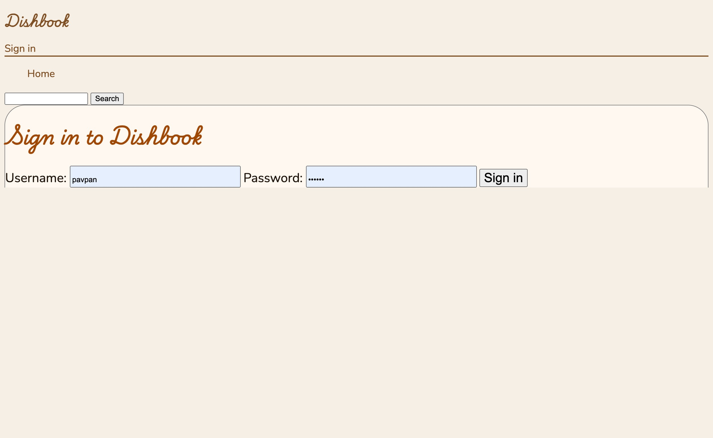

CS 3550 Assignment 1 (HTML & CSS)
=================================

**Status**: Draft \
**Due**: Phase 1 due **22 Aug**. Phase 2--5 due **29 Aug**.

In this assignment, you will set up a web server and write HTML for
the grading application that you'll build all semester. Specifically,
in this assignment, you will demonstrate that you can:

- Configure and start a Django web server serving static HTML and CSS
- Find and fix problems in generated HTML code
- Modify the HTML to add semantics and CSS handles
- Establish visual hierarchies with text, including fonts and spacing
- Add colors, borders, and backgrounds to establish a brand identity

The assignment is due Friday, 29 August, before midnight. The course's
normal extension policy applies. Hand in your finished assignment by
pushing it to your repository on Github.

This assignment is intended take 6--8 hours and must be done solo. If
you get stuck for more than an hour or so, get help on Piazza or sign
up for an office hours slot.

All code you turn in must be yours. You cannot copying code from
sources on the internet, *including source code from live websites* or
generated by AI tools. You may discuss, plan, and confer with your
peers about how to do this assignment, or ask their help debugging
your code. However, any peers you do confer with must be listed on the
assignment cover sheet.

Setting up Python, Django, and your Repository
----------------------------------------------

**Find or install Python 3,** at least version 3.10 but newer is
better. CADE machines have Python 3.10 installed. Python is available
for all platforms from [python.org]; on macOS, Python comes
preinstalled, but it may be out of date. (You can also install Python
through VS Code, Homebrew, the Windows Store, your system package
manager, or any other source, as long as it is recent enough.) Check
your Python version with:

    python3 --version

You might need to use `py` or `python` instead of `python3`. Make sure
it is prints Python 3.10 or above. *Make sure it is not the obsolete
Python 2 or an older Python 3.*

Make sure that your Python has database support:

    python3 -c "import sqlite3"

If this command succeeds with no output, that means you have database
support. This should be the case for most Python installations. If you
see what looks like an error, seek help from the instructors.

**Next, install Django** by running:

    python3 -m pip install django

Check your Django version by running:

    python3 -m django --version
    
Make sure the version starts with 5.0. On macOS, you might need to
pass the scary `--break-system-packages` flag in the `pip` command.
It's probably safe. If you're familiar with Python and want to use
something else, like a `venv` or `uv`, you can do that too.


Phase 1: Creating the Django Project
------------------------------------

Check out your Github repository. You will do all of your coding for
this class inside this folder. You'll need to accept an invitation to
do this. If you don't have an invitation, contact the instructors
immediately.

Run the following commands in a terminal:

    cd <path>
    python3 -m django startproject cs3550 "."


In the first command, replace `<path>` with whatever path is necessary
to get to the Git repository. The second command creates a Django
"project" called `cs3550` and puts it in the current directory. In
this an all other cases in this class, replace `python3` with `python`
or `py` if that's what it's called on your system.

Test that this worked by running:

    python3 manage.py runserver

This should print some messages, ending with the line "Quit the server
with CONTROL-C". Open your browser and go to http://localhost:8000/;
you should see a page informing you that "The install worked
successfully! Congratulations!" You can now press `Ctrl+C` in the
terminal to stop the server.

*MacOS users*: In some cases, depending on where you've put these
files, you may see errors from "Watchman". Usually this means you need
to press "yes" on some permissions dialogs that have popped up, but if
the error persists, you can add `--noreload` to the `runserver`
command. This disables Watchman. You'll then need to terminate and
restart the server every time you edit your application.

If at any point in these steps you get what looks like an error
message, ask for help.

Now edit the file `cs3550/settings.py` inside your repository. Find
the line that starts with `STATIC_URL` and add the following line
below it:

    STATICFILES_DIRS = [ 'static/' ]

Create a directory called `static` directly inside your repository.
Your repository should now contain the following files and folders:

- A folder `cs3550`, which in turn contains `settings.py`, `urls.py`,
  `wsgi.py`, `asgi.py`, and `__init__.py`. It might also contain a
  `__pycache__` directory, which is auto-generated by Python.
- A file `manage.py`, which you used in a command above
- An empty folder `static`
- Possibly a file called `db.sqlite3`

Sixth, create the file `.gitignore` in the root of your repository. It
may have been created for you. Add the following contents, or check
that they're already there:

    uploads/*
    db.sqlite3
    *.pyc
    .DS_Store
    autotester
    *~

This makes sure you don't commit any autogenerated files to Github.

Seventh, create a file `test.html` in the `static` directory. Add the
following contents:

    <!doctype html>
    The test worked.

Test that this all worked by running:

    python3 manage.py runserver

Eighth, open your browser and go to http://localhost:8000/static/test.html

You should see the words "The test worked." on your screen. If you do,
commit everything to Github; Phase 1 is done. If you do not, get help.


General Goals
-------------

Your goal in this homework assignment is to write static HTML for five
pages on the "Dishbook" recipe sharing site: the homepage, a recipe
page, the search results page, the user profile page, and the login
page.

With your final HTML and CSS, the five pages should look like this:




You'll need to use the following CSS properties:

- `background-color` and `color`
- `font-family`, `font-size`, `font-weight`, `text-decoration`, and `line-height`
- `border`, `border-radius`, and `box-shadow`
- `list-style`, `display`, and `transform`

You should also make sure to use semantic HTML and minimize the number
of unnecessary elements and attributes in your HTML. Use simple,
tag-based selectors when possible.


Phase 2: Clean up generated HTML
--------------------------------

Download the files is the [`hw1` folder](hw1/); they should be HTML
files `index.html`, `recipe.html`, `login.html`, `search.html`. Save
these files to your `static/` folder. Run the server and check that
you can access these files from
http://localhost:8000/static/index.html; if you open up that page, you
should see some text welcoming you to the "Dishbook community".

These initial file were generated by ChatGPT using a short prompt
describing Dishbook and what's supposed to be on each page. This gives
you something to work from, but unfortunately, this starting point
isn't very good, so in this Phase you're going to clean it up.

Go through each HTML file one at a time. Keep a look out for the
following issues that we want to fix:

- Broken links. All of the links on all of the pages should work, and
  all of the images should show up. You can download the necessary
  images from the [`hw1` folder](hw1/), put them in your `static/`
  folder, and then link to them as `/static/<name>.png`.
- Extra content. ChatGPT sometimes inserts content that simply isn't
  supposed to be part of the web page. Find and delete it.
- Unnecessary wrapper elements. ChatGPT inserts a lot of `<div>` and
  `<span>` elements, partly to support microdata (see below). Delete
  them unless you're using them for styling or layout. Likewise,
  remove `<figure>` elements unless they combine an image with a
  caption.
- Header content. The page header should be the same for all pages,
  except of course that they should all have different page titles.
  The page titles should follow a consistent format, like `Title -
  Dishbook`. Since ChatGPT generated each page a bit differently,
  you'll probably want to look at all of the page headings, combine
  the best pieces, and copy that to all of the pages.
- Heading hierarchy. ChatGPT doesn't always use the right heading
  number; make sure all of your headings are in order, with an `<h1>`
  for the page title and similarly-global headings, `<h2>` for
  subsections below that, and so on.
- Unnecessary `class` and `id` attributes. You only need to add
  classes and IDs when they are necessary for something, like classes
  for CSS styling or IDs for linking labels and inputs.
- Unnecessary `role` and `aria-label` attributes. ChatGPT loves adding
  these for some reason. Most of the `role`s are redundant with the
  HTML elements used and most of the `aria-label`s should be replaced
  by proper headings.
- Other unnecessary attributes. For each attribute, try removing it;
  does it affect the page at all? ChatGPT likes to explicitly assign
  the default value of attributes like `type`; there's no reason to do
  that.
- For the "prep time", "cook time", and so on, use an HTML definition
  list element `<dl>`. Use
  [MDN](https://developer.mozilla.org/en-US/docs/Web/HTML/Reference/Elements/dl)
  to learn how to use this unusual element.
- Microdata. The `itemtype`, `itemscope`, and `itemprop` attributes
  are for something called HTML Microdata, which are used by search
  engines. We won't be using microdata, so you can remove these
  attributes and associated elements.
- Some of the tags and attributes have typos; I inserted those on
  purpose. Fix them.

Also remove the implicit `<html>`, `<head>`, and `<body>` elements and
make sure all pages have the standard `<!doctype html>` doctype.

Review your final HTML. Make sure that you know the meaning and
purpose of every element and attribute on the page.


Phase 3: Write a profile page
-----------------------------

Create a new file in `static/` named `profile.html`. Copy and paste
the page heading into it, and then write the page content. The page
should contain everything in the profile screenshot: the user's full
name (Alice Apron) and photo (find it in the [`hw1` folder](hw1/));
how long they've been a user; and the following "about me" text:

> I cook the kind of food that feels like home, and wander the world
> from my stove. My recipes are weeknight-friendly, written with clear
> steps, sensible substitutions, and the occasional gram weight when
> it helps. I love cast iron, pantry staples, and dishes that scale
> for friends and neighbors. If you try something, tell me what you
> changed—variation is the point.

Below that, the page should show Alice's recipes; all six should use
the same markup. As with Phase 2, make sure to write valid,
well-indented, and easy-to-read HTML code. Don't add unnecessary
elements or attributes, and only add `id`s and `class`es in later
phases when it helps with styling.

Mark the images on the page as lazy-loaded. This makes sure profile
pages load quickly even for users with a lot of recipes and photos.
Use the `loading` attribute for this.

At the same time, make sure all of your HTML is valid. Use a clear
heading hierarchy, make sure each `<input>` has a `<label>`, that
every link works, and that every photo has `alt` text.


Phase 4: Establish typography
-----------------------------

The Dishbook website will use two main fonts:

- `Nunito`, a friendly, rounded, sans-serif font for body text
- `Playwrite USA Traditional`, a cursive font for headings

These fonts give Dishbook a friendly, cozy, hand-made feeling. Find
both fonts on Google Fonts. Get the "embed code" for them; on the
"embed code" page configure Nunito to include both italic and roman at
all weights, but for Playwrite USA Traditional only include 400
weight. By selecting only the parts of a font we need, we reduce
download size and make our web page faster to load. Add the HTML embed
code provided by Google Fonts to the beginning of each HTML page.

Create a `main.css` file in your `static/` folder, and `<link>` to it
from every HTML file. You'll be adding CSS code to this file to make
the Dishbook web page look more like the screenshot.

First, set all headings to use the Playwrite USA Traditional font; in
CSS, this font is called `Playwrite US Trad`. Set all other text to
use the Nunito font. Make sure to add appropriate fallback fonts.

Set the size of all body text on the page to 18 pixels. Set the size
of headings to 25% larger than that, except for the main title (like
the recipe name), which should be 80% larger. On the login page, set
the text inside the login form (including text entries, labels, and
buttons) to be 25% larger than the default.

Bold the appropriate text. For the "Prep time" and similar text, set
the weight to 600, which is a little less bold than "bold".

Set the `line-height` of the ingredients, steps, and description to
1.25. Don't change the line height of other text on the page, like the
headings, they'll get too spaced out.


Phase 5: Borders, colors, and ornamentation
-------------------------------------------

The page uses just a couple colors: #F7F1E8 "cream", #2E261C "cast
iron", #A8570C "cacao", #FFF9F1 "paper", #888 "ash", #8B5E34 "oak",
and in a few places #FFF pure white. Note that these aren't the
standard names for these colors, just thematically appropriate names
chosen to help you remember which is which.

Assign the appropriate text color to body text, links ("oak" normally
and "cacao" on hover), and headings. Also use the appropriate color
for the hash signs in the list of tags. Links should be underlined
*only* on hover.

On the main page, make the "Create and account" and "Browse recipes"
links look like buttons. Make the background / foreground colors cream
and oak (on hover, cacao and paper). Assign `padding: .5em 1em` to
make the button itself a bit bigger, and round the corners into a
"pill" shape.

On the recipe page, rotate the photo by 2 degrees. You can do that by
assigning `transform: rotate(2deg)`. It helps the page look a bit more
casual, as if it's a paper cookbook that you pasted a photo into.
Also, give the photo a five-pixel white border with a three-pixel
corner radius; this makes it look a little bit like a polaroid photo,
heightening the effect.

Assign the appropriate background the to the page as a whole and also
the main portion of the page where the page-specific content is.

Finally, assign the appropriate borders to the main portion of the
page, in the heading, and on the login page. Match the width and color
of each border.

Hide the bullet points for the list of tags and ingredients, and in
the nav bar, and for recipes on the home / search / profile pages.
Keep the numbers for the list of steps.


Write a cover sheet
-------------------

Rerun `python3 manage.py runserver` and confirm that every page looks
as expected. Also confirm that all of the links work and that all of
the HTML source code is readable. If you find any problems, use the
browser developer tools or an HTML validator to understand and correct
the problem.

Once you are sure everything works correctly, copy-and-paste the
following text into a new empty text file called "HW1.md" located
directly in your repository (not in the `static/` folder):

```
Homework 1 Cover Sheet
----------------------

In this assignment, I completed:

- [ ] Phase 1
- [ ] Phase 2
- [ ] Phase 3
- [ ] Phase 4
- [ ] Phase 5

I discussed this assignment with:

- ...
- ...
- ...

[ ] I solemnly swear that I wrote every line of code submitted as part
of this assignment (except Django's auto-generated code and the
assignment starter HTML).

The most interesting thing I learned in this assignment was ...

The hardest thing in this assignment was ...
```

In the first list, replace `[ ]` with `[x]` for each phase of the
assignment you completed.

In the second list, replace the `...`s with the names of all other
persons (student, friend, family, online stranger) that you discussed
this assignment with.

In the oath below that, check the box. Recall that, while you may
discuss the assignment in broad strokes, you must write every line of
code submitted by you, as stated in the oath below this list. This
includes the use of AI tools such as ChatGPT.

In the last two paragraphs, replace the `...` with the most
interesting and the most difficult aspect of this assignment. Don't
just make them a few words; write in full sentences. The instructors
use your answers to make these assignments more interesting and
easier.


How you will use this
---------------------

HTML and CSS are the core front-end technologies. Everything you see
on every web page, all across the web, comes back to these two
technologies, and they're also typically the starting point for making
a new website: establishing the right HTML structure and applying
basic styles with CSS.

In [Assignment 2](hw2.md) we'll go further to establish the layout of
the web page and make sure the page works on mobile devices. In most
web pages, that's a critical requirement. Then, in [Assignment
3](hw3.md), we'll start generating the HTML programmatically, based on
data in a database. For example, each step in a recipe will be one
iteration of a `for` loop. That's how most web sites generate HTML.

Writing valid, semantic HTML is important because it helps with
styling, search engine results, and accessibility. For example, `alt`
text helps search engines find pages with relevant images. And it also
helps blind people who use screen readers. (And if that's not you,
now, consider that things may change as you get older.)


Grading Rubric
--------------

This assignment is worth 100 points. The different phases are worth
different weights:

**Phase 1** is worth 5 points. It is graded on:

- Your repository must contain a Django project named `cs3550`
- Your web server must start and respond to requests on `localhost`
- Your web server must successfully show the test page at
  http://localhost:8000/static/test.html
  
If you pass all auto-tests up to and including "Checking that
`/static/test.html` exists", then you have completed this phase.

Note that if you don't complete this phase, it is impossible to grade
most of the others, so you won't receive a passing grade.

**Phase 2** is worth 35 points. It is graded on:

- All links and images on the page work
- All of the mistakes have been fixed
- All unnecessary elements and attributes have been removed
- Definition lists are used correctly
- The HTML is clean, minimal, correctly indented, and easy to read.

**Phase 3** is worth 15 points. It is graded on:

- All of the required content must be present.
- All links and images on the page work
- Appropriate HTML tags and attributes are used for each part of the page.
- The page header is identical to other pages and all recipes card
  use identical structure.

**Phase 4** is worth 20 points. Is is graded on:

- The page must include the correct fonts and link to a `main.css` file
- The correct font must be used for all elements
- The correct font size and weight must be used for all elements
- The correct line height must be used for all elements

**Phase 5** is worth 20 points. It is graded on:

- All text must have the appropriate color
- All backgrounds must be the appropriate color
- All borders must be the appropriate colors, thicknesses, and radii
- Tags and ingredients must not have bullet points, but steps should
  still be numbered.

**Cover Sheet** is worth 5 points. It is graded on:

- Cover sheet is formatted correctly.
- All questions on the cover sheet have coherent answers.

Note that if your cover sheet does not list all people you discussed
the assignment with, or misrepresents others' work as your own, that
is academic misconduct and can result in severe sanctions beyond the 5
points the cover sheet is worth. In the most severe cases, the
sanction for academic misconduct is failing this course.
