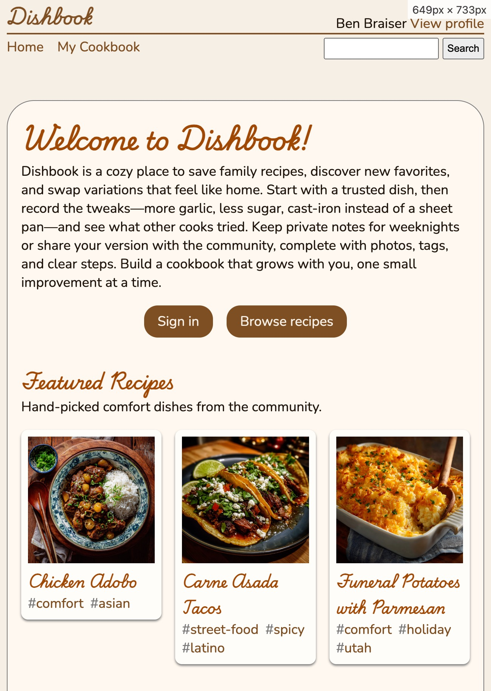
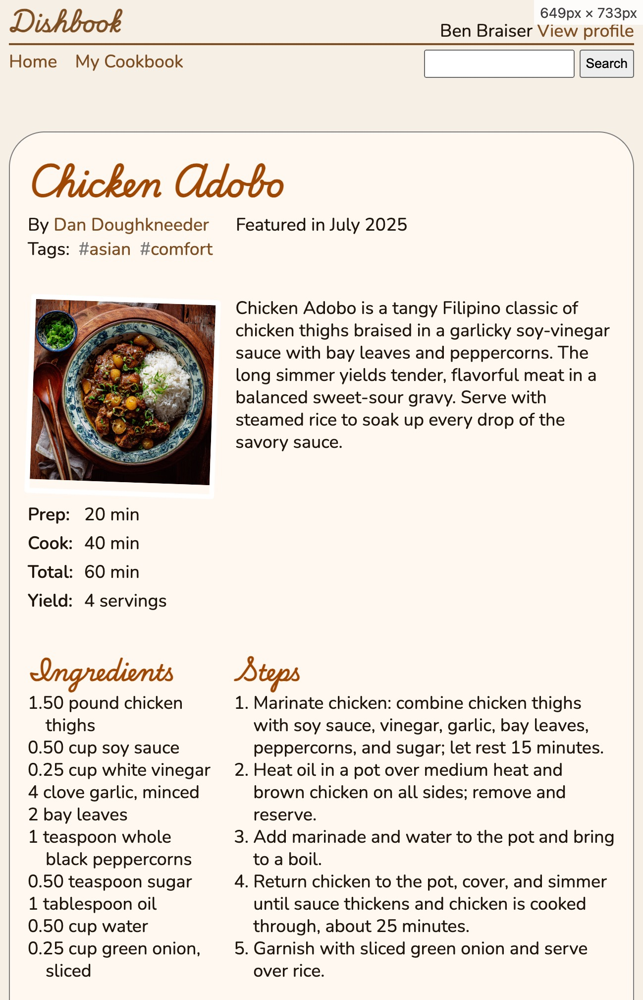
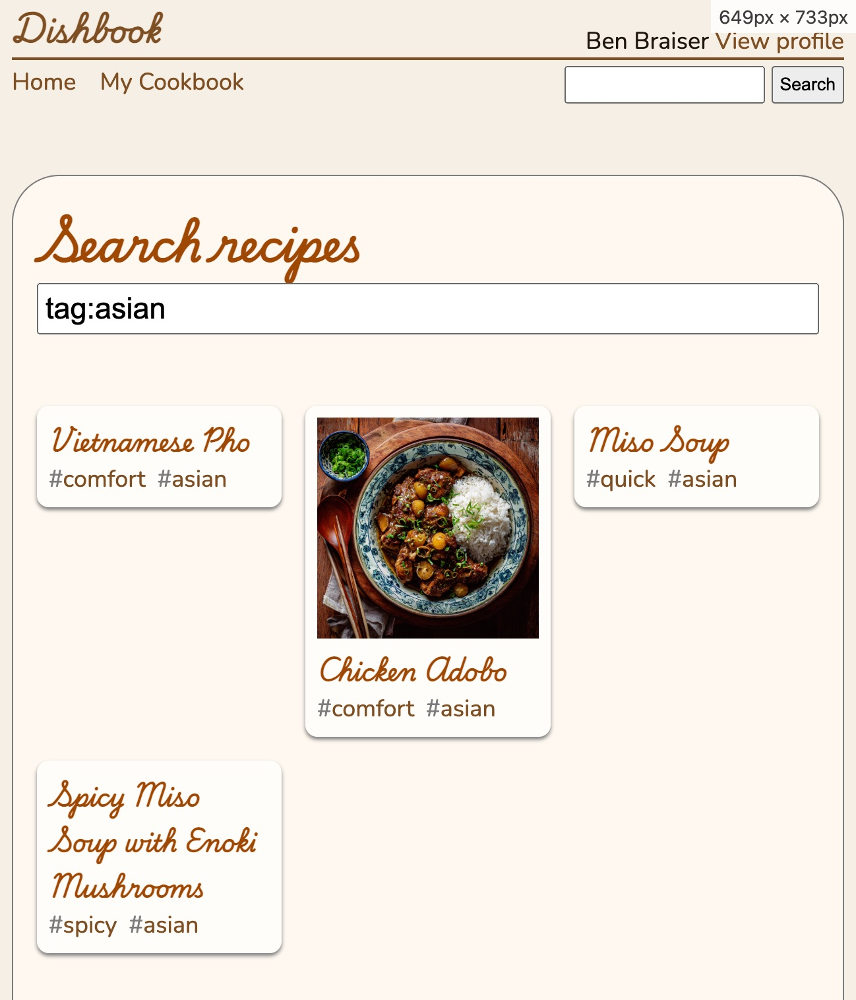
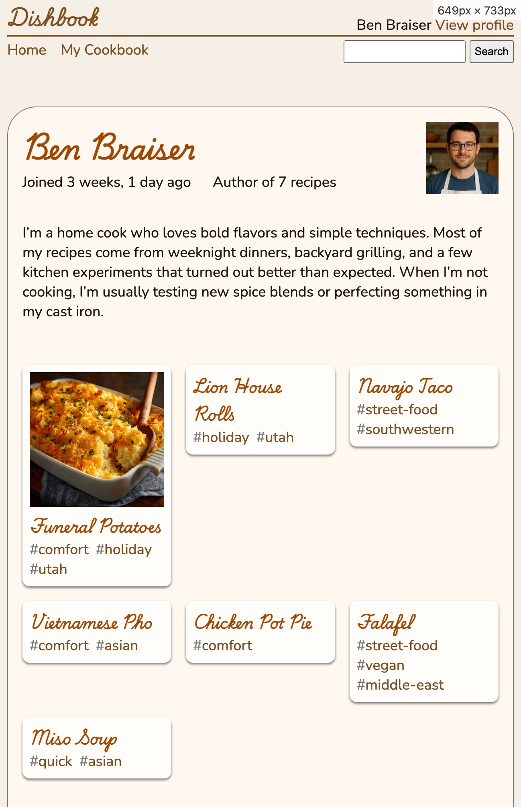
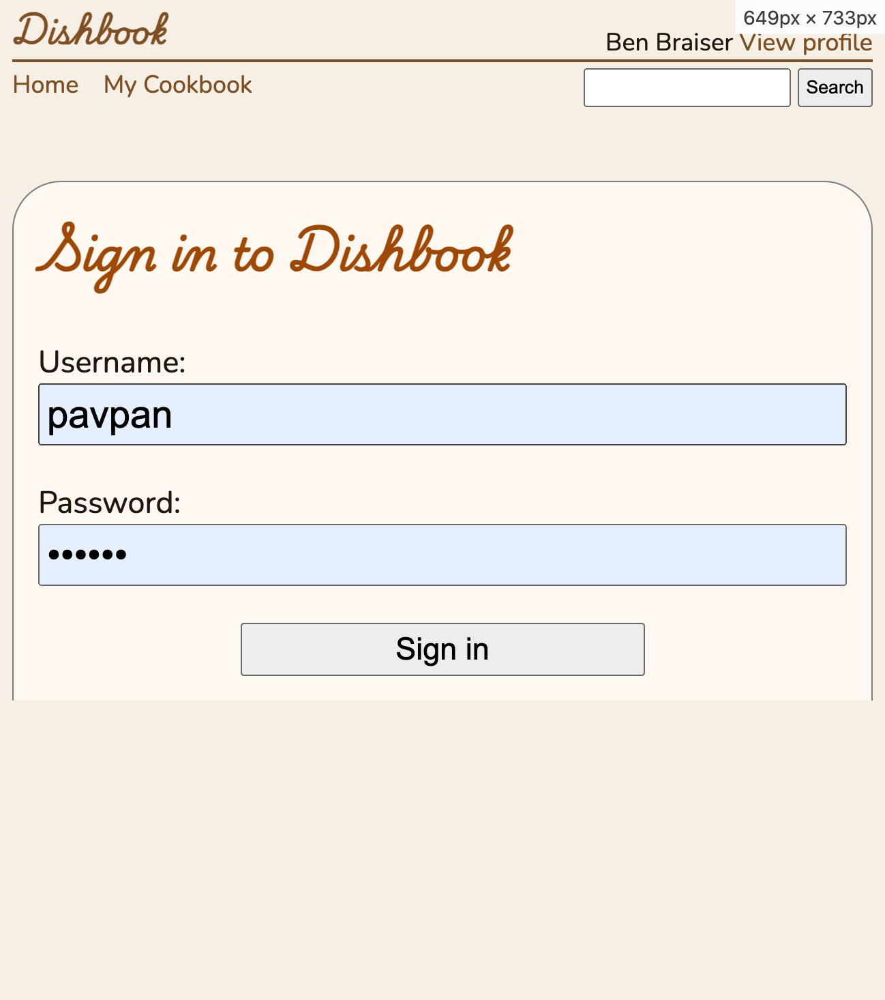

CS 3550 Assignment 2 (Layout)
=============================

**Status**: Final \
**Due**: Phase 1 due **5 Sep**. Phase 2--5 due **12 Sep**.

In this assignment, you will use flex-box to set up the layout of our
"Dishbook" application and ensure that the layout adjusts correctly to
screens and devices of various sizes. Specifically you will:

- Set up a simple centered page layout
- Establish proper whitespace between page elements
- Lay out cards and metadata rows
- Ensure that the layout is responsive and works on mobile

The assignment is due Friday, 12 September, before midnight. The
course's normal extension policy applies. Hand in your finished
assignment by pushing it to your repository on Github.

This assignment is intended take 6--8 hours and must be done solo. If
you get stuck for more than an hour or so, get help on Piazza or sign
up for an office hours slot.

All code you turn in must be yours. You cannot copying code from
sources on the internet, *including source code from live websites* or
generated by AI tools. You may discuss, plan, and confer with your
peers about how to do this assignment, or ask their help debugging
your code. However, any peers you do confer with must be listed on the
assignment cover sheet.

Phase 1: Adding a CSS Reset
---------------------------

Add the following line to your `main.css` file:

    * { margin: 0; padding: 0; box-sizing: border-box; }

Start your server, go to http://localhost:8000/static/main.css, and
make sure you see this line. If you don't, try to hard-refresh by
pressing Ctrl+Shift+R in your browser. This asks the browser to
refresh without using its cache. You'll want to get in the habit of
doing this when you're working on CSS.

Once you see this line, go back to your index page at
http://localhost:8000/static/index.html; it should look different and
a bit uglier: all of the text should be smooshed together and there
should be less whitespace. That's OK: the default margins might look
better than no margins, but the CSS reset gives us a blank slate to
start with which will make layout less confusing.

Go to each of your HTML pages and add the following line somewhere
near the top. (Ideally it should go after the `<meta charset="utf-8">`
line but before anything else.)

    <meta name="viewport" content="width=device-width, initial-scale=1">

This tells the browser that our web page supports mobile layout. It
doesn't yet, but it will! Commit everything to Github; Phase 1 is
done once you pass the auto-tester.


General goals
-------------

Our goal in this homework assignment is to add CSS to the page to
match the following screenshots:

<div style="display:flex;align-items:start">





</div>

To do so, you will largely use flexbox layout, in particular the
following properties:

- `display`, specifically the `flex` value, and `flex-direction`
- `width`, `height`, and `gap`
- `justify-content` and `align-items`
- `flex-wrap` and `text-wrap`
- `padding` and, optionally, `margin`
- `text-indent` and `text-wrap` when directed

You may also want to use `calc` in various places to simplify
implementation.


Phase 2: General page layout
----------------------------

Ensure that you set the `font-size` to `18px` on the `<html>` element.
It is the `<html>` element's font size that determines the size of a
`rem`, and we want a `rem` to be `18px`.

Write CSS so that the page content is at most `700px` wide; this will
make body text about 80 characters wide, which is about as wide as you
want to go. Center the page content. On pages narrower than 700 pixels
make sure that the page content gets narrower. Use flex-box. You may
want to apply CSS to the `html` and `body` elements. Add a `.5rem` gap
between the left and right edges of the browser window and the page
content itself; this won't matter for wide screens but will matter
for narrower ones.

Add a `3rem` gap between the page header (including the menu) and the
main area of the page (containing, like, the recipe).

Add a `1rem` gap between the border of the main area and the content
inside. Inside that main area, add a `2rem` gap between the heading
area and the rest of it. On the recipe page, also add a `2rem` gap
between the recipe description and the recipe ingredients.

Next, lay out the page header. The page header should consist of two
rows; the top row should contain the "Dishbook" title and the "View
profile" links, while the second row should contain the "Home" and "My
Cookbook" links as well as the search form.

Make sure that the "Home" and "My Cookbook" links are placed
horizontally; add a gap of `1rem` between links. Make sure that the
"View Profile" link and the "Dishbook" title line up at the bottom of
the text. Make the profile information and search form right-aligned.
Add a `.25rem` gap between the search bar and the horizontal line
above it, and add `.25rem` of padding inside the search bar and search
button.


Phase 3: The recipe page
------------------------

Let's start with the header at the top of the recipe page. This has
two parts: the recipe name itself, and then a bunch of metadata like
the author, whether the recipe has been featured, its tags, and so on.
Make the metadata blocks lay out horizontally, with `1.5rem` gaps in
between. If there are too many to fit on one line, make them wrap to
two lines; don't have any gap between lines. The list of tags should
also be horizontal, with an `.5rem` gap between tags.

Give the ingredients list a left-padding of `1rem` and a `text-indent`
of `-1rem`; the effect should be a kind of hanging indent where each
ingredient starts at the left edge of the ingredients list, but long
ingredient names are indented a bit to help you see where an
ingredient continues onto the next line.

Give the list of steps a left-padding of `1em` to line up the step
numbers with the edge of the "Steps" label. By default the numbers
start about `1em` to the left of the left edge of each `<li>` tag.

Make the photo on the recipe page no wider than its parent element.
Add `.5rem` of whitespace below it. Now focus on the
Prep/Cook/Total/Yield information below the photo. Each "Label: value"
should be on one row, with `.5rem` gap between them and `.25rem` gap
between rows. The label should always take up a quarter of the
remaining space, while the value takes up the other three quarters.
This effect is probably easiest to achieve using `calc` and
`flex-wrap`.


Phase 4: The other pages
------------------------

Let's take a look at the buttons on the index page. Those should (of
course) be centered and horizontally adjacent, with a `1rem` gap
between them and also a `1rem` gap between the previous paragraph and
the buttons.

Next, let's work on the "card" layout that we use on the index page,
and also on the search and profile pages.

The cards go in a grid, with three cards per row and `1rem` gaps in
between and also `1rem` gaps along the top and bottom (but not left and
right) edges. Inside each card, there should be a `.5rem` gap between
the card edge and the content. The photo on the card (if any) should
be no wider than the card.

The cards can be different heights (either due to long recipe names,
lots of tags, or some recipes having photos and others not), in which
case each row should be aligned at the top but different rows can have
different sizes.

Cards have tags inside. Since cards are narrow, we have to allow the
tags to wrap onto multiple lines; don't allow any gap between lines
but keep the gap between tags at `0.5rem`. Don't allow the tag name
itself to wrap by setting its `text-wrap` to `nowrap`.

On the search page, make the actual search box as wide as it can be,
with `.25rem` of padding inside so that search text isn't cramped.

On the profile page, make the user logo appear to the right of the
page title / metadata. Make it `5rem` wide and tall, and align it to
the right of the main content area. Keep a `1rem` gap in between.


Phase 5: Responsive layout
--------------------------

On the recipe page, set up the layout where the photo/metadata is
side-by-side with the recipe description and the ingredients are
side-by-side with the recipe steps. Don't change the source order of
the page---the HTML should still contain metadata, description,
ingredients, and steps in that order. You may need to add two `div`
elements. In each pair of side-by-side elements, have a `1rem` gap
between them and then split the remaining space 1:2 (meaning the
left sidebar is a third of the remaining width and the right side is
two thirds of the remaining width). There are a number of ways to
achieve this; you could either use `width` together with `flex-grow`
and `flex-shrink`, or you could use `width` with `calc` values. Either
way is fine. Make sure the two sidebar pairs line up on the screen
even as you resize the screen.

However, if the screen width is `500px` or narrower, the sidebars will
get too narrow (try it!). So add CSS that does away with sidebars when
the page is too narrow. Without sidebars, the order of page elements
should be photo & times/yield, description, ingredients, and then
steps. There should be a `2rem` gap between each.

Also, for narow screens, the extra padding around the edges of the
screen wastes space. Make that padding disappear below 500 pxiels.
Also remove the left and right border, which would look weird right up
against the screen edge. Add back `0.5rem` of padding inside the page
header instead. Make sure the horizontal line inside the page header
goes edge-to-edge.

Now, switch to the login page. Make each label / text box combination
one row, with a `1rem` gap in between. Make each text box 80% the
width, and make it right-aligned. Give each text box `0.25rem` of
padding. Set the `align-items` of each label/text box combination to
`baseline`; this is similar to `end` but it lines things up according
to the "text baseline", which is the imaginary line on which English
text is written.

Make the login button 50% of the width of the page, and center it. But
make sure that it never goes below `200px` wide, even on very narrow
screens, like below 400 pixels.

However, this won't look good if the page starts shrinking below 700px
(try it!). So for pages less than 700px wide, instead put the label
and the text box on separate lines, with no gap between them, and then
add `1rem` of gap between the username box and the password label.

Now head back to the search page. Three cards looks good on wide
screens, but once the screen gets small those cards get too small.
Let's do two cards per row below `600px` and one card per row below
`400px`. This way the cards are never much less than 200 pixels wide.

Test every page at a range of sizes. Make sure you test at least:

1. Below 400 pixels; an iPhone 12 Pro would see this
2. Between 400 and 500 pixels; a Pixel 7 would see this
3. Between 500 and 600 pixels; a Surface Duo would see this
4. Between 600 and 700 pixels; an iPhone SE in landscape mode would
   see this
5. Over 700 pixels; desktop users would see this

Make sure the appearance of the page is reasonable at every size.


Write a cover sheet
-------------------

Rerun `python3 manage.py runserver` and confirm that every page looks
as expected. Try multiple page sizes, from under 400 to over 700
pixels and all sizes in between. Test every page.

Once you are sure everything works correctly, copy-and-paste the
following text into a new empty text file called "HW2.md" located
directly in your repository (not in the `static/` folder):

```
Homework 2 Cover Sheet
----------------------

In this assignment, I completed:

- [ ] Phase 1
- [ ] Phase 2
- [ ] Phase 3
- [ ] Phase 4
- [ ] Phase 5

I discussed this assignment with:

- ...
- ...
- ...

[ ] I solemnly swear that I wrote every line of code submitted as part
of this assignment.

The most interesting thing I learned in this assignment was ...

The hardest thing in this assignment was ...
```

In the first list, replace `[ ]` with `[x]` for each phase of the
assignment you completed.

In the second list, replace the `...`s with the names of all other
persons (student, friend, family, online stranger) that you discussed
this assignment with.

In the oath below that, check the box. Recall that, while you may
discuss the assignment in broad strokes, you must write every line of
code submitted by you, as stated in the oath below this list. This
includes the use of AI tools such as ChatGPT.

In the last two paragraphs, replace the `...` with the most
interesting and the most difficult aspect of this assignment. Don't
just make them a few words; write in full sentences. The instructors
use your answers to make these assignments more interesting and
easier.


How you will use this
---------------------

The purpose of this assignment was to give you a lot of practice with
flex-box, which is a general-purpose and powerful layout primitive
used by a lot of modern websites. Lots of web pages use flex-box for
the overall page layout and also for individual components like cards,
forms, lists, and menus. Being able to rapidly build flex-box layouts
will make it much easier to develop complex user interfaces.

Right now, most of the "flexibility" that we are using flex-box for is
to respond to changes in the size of the browser window (including
because the user is using a device like a phone). But in [Assignment
3](hw3.md), we're going to add an important extra bit of flexibility:
adjusting the layout for different page content, like for different
recipes or users. It's going to be especially important to handle
optional elements, like whether or not a recipe has a photo or a user
has a profile picture.

If you do end up doing front-end development in the future, you'll
probably also want to extend your skills by learning about [Grid
layout][grid-mdn]. Grid layout builds on flex-box layout by allowing
fine control of both axes, flexibly resizing your application in both
dimensions. It's quite a bit more complex than flex-box (including
named areas, wrapping and row templates, and so on) but it builds on a
lot of the same primitives, namely content and whitespace,
flexibility, and responsive layout.

[grid-mdn]: https://developer.mozilla.org/en-US/docs/Web/CSS/CSS_grid_layout/Basic_concepts_of_grid_layout


Grading Rubric
--------------

This assignment is worth 100 points. The different phases are worth
different weights:

**Phase 1** is worth 5 points. It is graded on:

- Your repository must contain a CSS Reset in its `main.css` file
- Each page must have the `<meta name=viewport>` tag.
  
If you pass all auto-tests up to and including "Check that
`/static/profile.html` has a `<meta name=viewport>` tag", then you
have completed this phase.

**Phase 2** is worth 15 points. It is graded on:

- Page content is centered on all pages, 700 pixels wide, and narrower
  on narrow screens
- Page header laid out in two rows, with all content horizontal and
  correctly vertically aligned
- Profile links and search box right-aligned

**Phase 3** is worth 25 points. It is graded on:

- Heading area laid out correctly, with metadata (including tags) laid
  out horizontally and wrapping
- Photo has the correct width, with the "polaroid effect" and correct
  spacing
- Prep/Cook/Total/Yield section uses correct layout
- Indentation of ingredients and steps is correct

**Phase 4** is worth 20. Is is graded on:

- Cards are correct size and have the correct whitespace
- Cards wrap appropriately to multiple lines, and align correctly
  within a line. Tags, but not any single tag, wrap to multiple lines.
- Buttons and search field have the correct size, alignment, and
  whitespace.
- Profile photo is correctly sized and placed.

**Phase 5** is worth 30 points. It is graded on:

- Sidebar exist for large screens, resize correctly, and disappear
  for screens less than 500 pixels wide
- Login form puts labels and text boxes side by side for wide screens,
  but not for narrow screens. Spacing and alignment is appropriate.
- The number of cards changes with the size of the screen as desired.
- The page padding and border disappear for narrow screens, and the
  page header adjusts appropriately.

**Cover Sheet** is worth 5 points. It is graded on:

- Cover sheet is formatted correctly.
- All questions on the cover sheet have coherent answers.

Note that if your cover sheet does not list all people you discussed
the assignment with, or misrepresents others' work as your own, that
is academic misconduct and can result in severe sanctions beyond the 5
points the cover sheet is worth. In the most severe cases, the
sanction for academic misconduct is failing this course.
