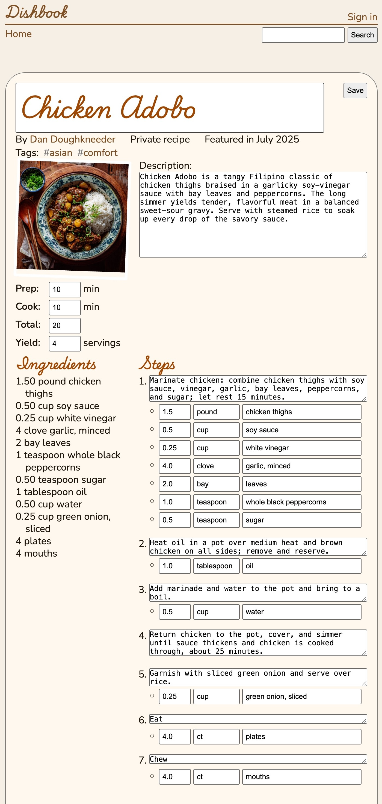
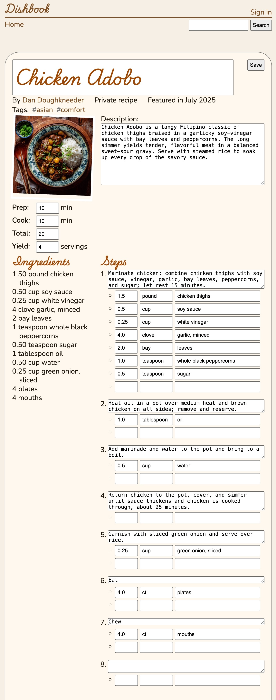

CS 3550 Assignment 4 (Forms and Controllers)
============================================

**Status**: Phase 1 final \
**Due**: Phase 1 due **17 Oct**, Phase 2--5 due **24 Oct**

About
-----

In this assignment you'll extend the recipe application you wrote in
[Assignment 3](hw3.md) to allow copying and editing recipes. You will:

- Write HTML forms to allow for file and grade submission
- Handle form submissions and update the database in response
- Produce human-readable error messages for invalid form submissions

The assignment is due Friday, 18 Oct before midnight. The course's
normal extension policy applies. Hand in your finished assignment by
pushing it to your repository on Github.


Phase 1: Form submission
------------------------

Make a copy of your `recipe.html` template called `edit.html`. Edit
`edit.html` and insert a `<form>` element around the entire page
contents (not the site header); it can go inside a `<main>` or similar
element if you have one, but should all of the recipe content on the
page. Give the `<form>` element an `action` of `/recipe/ID/edit`,
where `ID` is the recipe ID, and a `method` of `post`. Add the line
`` somewhere inside the form.

Add an `edit_recipe` view and route the URL `/recipe/ID/edit` to it.
Make the view render `edit.html` if requested with GET, but redirect
to `/recipe/ID/` when requested with POST. You can import `redirect`
from `django.shortcuts`.

In the `edit.html` template, add a `<button>` labeled `Save` inside
the page title (usually an `<h1>` element containing the recipe
title). Make sure this `<button>` is inside the `<form>`. In the
`recipe.html` template, add a `<form>` element in the same place; the
`<form>` should have an action of `/recipe/ID/edit` and a `method` of
`get`, and should contain a single `<button>` labeled `Edit`. It
should look like this:


Your button won't be right-aligned yet; you'll do that in Phase 2.
Make sure that clicking the `Edit` button shows the edit page and
clicking the `Save` button redirects back to the recipe page.

Once everything works, commit everything to Github. You should see the
Github Action turn green. If so, Phase 1 is done. If you do not, get
help.


Phase 2: The edit page
----------------------

In this phase, you will finish the `edit.html` template HTML and CSS.
Replace the recipe fields in `edit.html` with input elements.
Specifically, add elements for:

- The recipe title. This should be a one-line text input.
- The prep time, cook time, total time, and servings. All four should
  be number fields; the total time field should be read only.
- The recipe description. This should be a multi-line text input with
  10 rows. Make sure the contents of the text area are text, not HTML
  source code.
- Each recipe step. This should be a multi-line text input. The number
  of rows should be equal to the length of that step's description,
  divided by 50, and rounded up. You might want to define a method on
  `Step` to compute this length.
- Each step should have a bulleted list below the step containing all
  of the ingredients for that step. Each ingredient should consist of
  three fields: an amount, a unit, and the ingredient name. The amount
  should be a number, while the other two should be single-line text
  inputs.

Match the HTML structure of your `recipe.html` page where possible;
the `edit.html` should have the same layout as `recipe.html`.

Make sure to use the appropriate element and `type` for each field.
Use the `readonly` property to make a field read only. Add `<label>`
elements for all input fields; some are `visually-hidden`, match the
screenshot below. You might want to peek at the Phase 3 instructions
before you pick `id`s for each label/input pair.

Style the page. In the page title, make the `Edit`/`Save` button
appear in the top right corner of the page. Make each `<textarea>`
element take up the full width of its container. Use the `resize`
property to make it resizable only vertically. Set `vertical-align` to
`top` on step descriptions so that the step number appears in the
right place. Make the recipe title input box have really big text in
the correct font (`Playwrite US Trad`).

You can change the size of various input elements using the `size`
attribute. Choose reasonable values, consulting the screenshot below.
By default, `size` doesn't apply number inputs, but you can fix that,
at least on Chrome-like browsers, with this CSS:

    input[type=number][size] { width: calc(attr(size number) * 1ch + 2rem); }

Indent the bulleted list of ingredients below each step. Add `.25rem`
of padding between each ingredient vertically, and add `1rem` of
padding between steps.

The edit page should now look like this:



Note that, as you edit these fields, some parts of the page which
depend on those fields—like the total time or the ingredients
list—will not auto-update. That's expected.


Phase 3: Saving Recipes
-----------------------

In this phase, you will modify `edit_recipe` to save recipes when it
receives a `POST` request. For `GET` requests, the controller will
continue to render the `edit.html` page.

Modify `edit.html` to give `name`s to every editable field. For steps
and ingredients, embed the step/ingredient ID into the `name`.

Inside the `edit_recipe` controller, update the prep time, cook time,
serving count, recipe description, step descriptions, and ingredients
name/unit/amounts when a `POST` request is received. To update steps
and ingredients, iterate through all of the current `Recipe`'s
existing `Step`s/`Ingredient`s.

Handling errors is the next Phase, so you don't need to do that yet.

Every time you update a field on an object, add that object to a list
(perhaps call the list `updated_objects`). Once you're done processing
the form submission, call `save` on *every single object* in that
list. We need the list because calling `save` on just the `Recipe`
object *will not* `save` its `Ingredient`s or `Step`s. (We're saving
all `Step`s and `Ingredient`s to a list, instead of iterating through
them a second time, to make Phase 5 easier.)

Once you're done, redirect to `/recipe/ID` as usual.

If you'd like, you can have several lists for different types of
objects, and then use `bulk_update` instead of `save`. That's slightly
faster, but it isn't required or graded.


Phase 4: Handling Errors
------------------------

In this phase, you'll validate user submissions, handle invalid data,
and show errors.

> [!NOTE]
> Handling errors properly is important but laborious. That's not
> ideal for a homework assignment which has to be limited in scope.
> We'll thus take a few shortcuts, described below in the [How You
> Will Use This](#how-you-will-use-this) section. A proper production
> implementation wouldn't take those shortcuts, but it might well use
> a `Form` abstraction (Django provides one, for example) that handles
> these details.

Add an `errors` list in your `edit_recipe` controller. As you process
a form submission (that is, a `POST` request), if you see an erroneous
value, append a string error message to the `errors` list. Check for
the following errors:

- If any expected field (like the cook time) is not present
- If any numeric field (like the cook time) is not a number
- If any numeric field is given a negative, zero, or fractional value
  where that doesn't make sense. Specifically, cook and prep times
  must be non-negative integers but are allowed to be zero. Ingredient
  amounts may be fractional but must be positive. Serving counts must
  be positive integers.
- If any required text field is blank, or if it is too long.

You can refer to your `models.py` (or, if you didn't get a good grade
on it, to [HW3 Phase 2](hw2.md)) to determine which fields are
required and what their maximum lengths are. Make your error messages
sensible and unique for each error type.

If you see any errors while processing the form submission, *do not*
save any model objects and *do not* redirect. Instead, re-render the 
edit page.

Modify the `edit.html` template to output a list of all errors. This
list should go after the page header and metadata like the author name
or list of tags, but before the photo and recipe description. Put the
list inside an `<output>` element and use CSS to make this list red.

When checking for errors, update the fields of the `Recipe` object
*even if* the data is invalid. For example, if the user submits a
serving count of `0`, or even a serving count of `asdf`, update the
`Recipe`'s `serves` field anyway. *Do not* save the object, but *do*
pass the modified object to the `render` function when you re-render
the `edit.html` page. The user's invalid input will then be preserved
when the page re-loads with error messages. This preserves the user's
data and helps them fix errors.


Phase 5: Adding steps and ingredients
-------------------------------------

So far, our edit page allows us to edit existing `Step`s and
`Ingredient`s, but not to add new ones. Add an extra, blank step to
the end of the list of steps. For each bulleted list of ingredients
below each step, including for the extra step, also add a set of blank
entries for one extra ingredient. The edit page should now look like
this:




Since they don't have a step or ingredient ID, you'll want to give
them special names. Make sure the extra ingredients for each step have
different names. We recommend naming the extra ingredient fields with
the *step* ID, and giving the extra step and its ingredients totally
unique names.

When you process a form submission, you will need to handle these
extra fields. It might be best to have the extra-field handling
separate from the handling of normal, already-existing fields, even if
that involves some duplication.

Start with handling an extra `Step`. Check if the extra step has a
non-empty description. If it does, construct a new `Step` object. Make
sure to set its `recipe` and `order` fields appropriately (the new
step should come last, you can assume the `order` fields are numbers
from 1 to N). Don't call `Step.create`; you don't want to save the new
step until you've made sure the whole form has no errors. Instead,
just add the created `Step` object to your list of updated objects. If
the form is valid, it'll get saved along with everything else.

Next, handle the extra `Ingredient` objects. Note that there are
multiple fields for each ingredient. If any of those fields is
non-empty, construct a new `Ingredient` object (but don't save it).
Make sure to handle some tricky cases, including:

- An extra `Ingredient` has non-empty but invalid fields.
- An extra `Ingredient` has some blank and some non-empty fields.
- The extra `Ingredient` for the extra `Step` has some filled-in
  fields, but the extra `Step` description is empty or invalid.
  
If you see any errors when handling extra fields, show error message
like normal and do not save any newly-created objects to the database.
If there are errors, you *don't* have to preserve the user's invalid
inputs for the "extra" objects; that's possible but tricky.


Write a cover sheet
-------------------

Run your server and view each page on your website in your browser.
Read through the requirements of Phases 1--5 and ensure that all
requirements are met. Submit valid forms. Submit invalid forms. Edit
`<input>` and `<textarea>` attributes and try submitting very invalid
forms, like forms missing certain fields or fields with invalid IDs
inside. Test adding `Step`s and `Ingredient`s. Test adding invalid
`Step`s and `Ingredient`s.

If you find any problems, use the browser developer tools or `print`
debugging to understand and correct the problem.

Once you are sure everything works correctly, copy-and-paste the
following text into a new empty text file called "HW4.md" in the root
of your repository:

```
Homework 4 Cover Sheet
----------------------

In this assignment, I completed:

- [ ] Phase 1
- [ ] Phase 2
- [ ] Phase 3
- [ ] Phase 4
- [ ] Phase 5

I discussed this assignment with:

- ...
- ...
- ...

[ ] I solemnly swear that I wrote every line of code submitted as part
of this assignment (except that auto-generated by Django).

The most interesting thing I learned in this assignment was ...

The hardest thing in this assignment was ...
```

In the first list, replace `[ ]` with `[x]` for each phase of the
assignment you completed.

In the second list, replace the `...`s with the name of your partner
as well as any other person (student, friend, family, online stranger)
that you discussed this assignment with.

In the oath below that, check the box. Recall that, while you may
discuss the assignment in broad strokes, you must write every line of
code submitted by you, as stated in the oath below this list. This
includes the use of AI tools such as ChatGPT.

In the last two paragraphs, replace the `...` with the most
interesting and the most difficult aspect of this assignment. Don't
just make them a single sentence; the instructors use your answers to
make these assignments more interesting and easier.

Once you are done, commit everything and push it to Github. **Make
sure to include the text "Please grade" in your final commit message**
to help TAs identify the right commit to grade.

How you will use this
---------------------

Naturally, any web application has to handle form submissions to
collect or modify data from users. Forms can get
complicated—especially when, like here, multiple database objects are
involved. Adding objects is one complexity—which we did handle in
Phase 5—but a full application would also have to support deleting
objects, reordering them, and so on.

Handling invalid data, especially, is a big part of the polish that
makes applications easy to use, and is always labor-intensive. In this
assignment, there were a lot of details we skipped for the sake of
time, like placing error messages next to the field that caused them
(which requires a more elaborate data structure for storing errors)
and retaining even invalid data between attempts (which requires
special handling when adding "extra" fields).

Finally, one thing we're not yet handling in this assignment is
updating derived data, like updating a recipe's total time as the user
types a new cook or prep time. We'll do some of that in [Assignment
6](hw6.md).

Grading Rubrik
--------------

This assignment is worth 100 points. The different phases are worth
different weights:

**Phase 1** is worth 5 points. It is graded on:

- Your web server must start up without error
- Your web server must serve the recipe and edit pages
- Your recipe page must have an "Edit" button that redirects to the
  edit page, and the edit page must have a "Save" button that
  redirects to the recipe page
- The "Save" button should make a `POST` request, but the "Edit"
  button should make a `GET` request
  
If you pass all auto-tests, then you have completed this phase.

**Phase 2** is worth 15 points. It is graded on:

- The edit page must show input fields for every editable field
- Each input field must have the right type (including one-line /
  multi-line) and size
- The edit page's total time field must be read-only
- The edit page layout should match the recipe page
- Input elements on the edit page should be style correctly, including
  width, resizability, step number alignment, spacing, and the size of
  number fields.

**Phase 3** is worth 20 points. It is graded on:

- Submitting a valid form should save its data and redirect to the
  recipe page
- Every edited field of the recipe is saved
- Edits to subordinate objects, like steps and ingredients, are also
  saved

**Phase 4** is worth 30 points. It is graded on:

- Submitting an invalid form should show the edit page again
- Submitting an invalid form should not save any data, either on the
  recipe object or on subordinate objects
- All fields should check for type (string, number, float) and range
  (minimum and maximum size or length).
- Invalid fields, like those with invalid `Step` or `Ingredient` IDs,
  or IDs for steps and ingredients not related to the given recipe,
  should result in errors
- User-inputted values for fields of the `Recipe` object should be
  saved across re-renders of the same form. If this doesn't happen for
  fields of the `Step` or `Ingredient` that's ok; it's possible to do
  but not required.
- A list of all errors is shown at the top of the page in red.

**Phase 5** is worth 25 points. It is graded on:

- There are input fields on the edit page for adding new steps or
  ingredients
- When filled with valid values, the extra steps and ingredients
  should be created and saved in the database
- When filled with invalid values, nothing should be saved in the
  database and appropriate error messages should be shown

**Cover Sheet** is worth 5 points. It is graded on:

- Cover sheet is formatted correctly.
- All questions on the cover sheet have coherent answers.

Note that if your cover sheet does not list all people you discussed
the assignment with, or misrepresents others' work as your own, that
is academic misconduct and can result in severe sanctions beyond the 5
points the cover sheet is worth. In the most severe cases, the
sanction for academic misconduct is failing this course.
