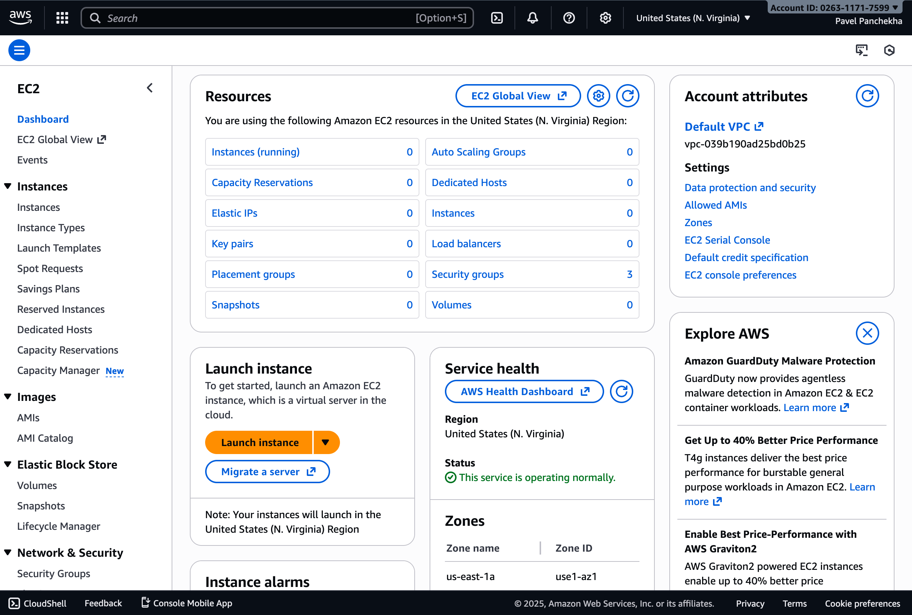
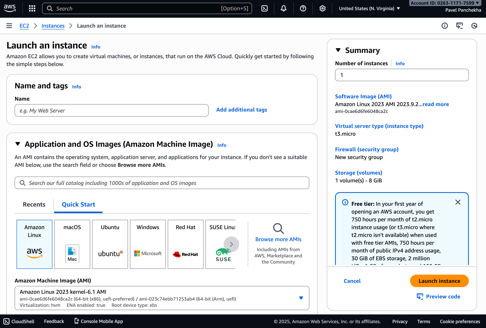
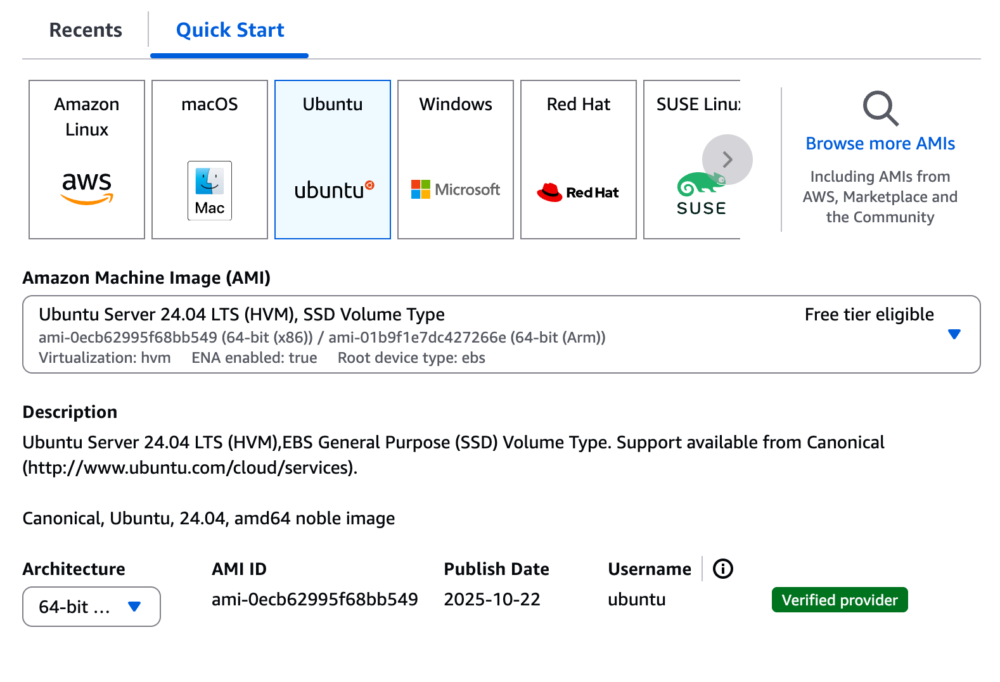
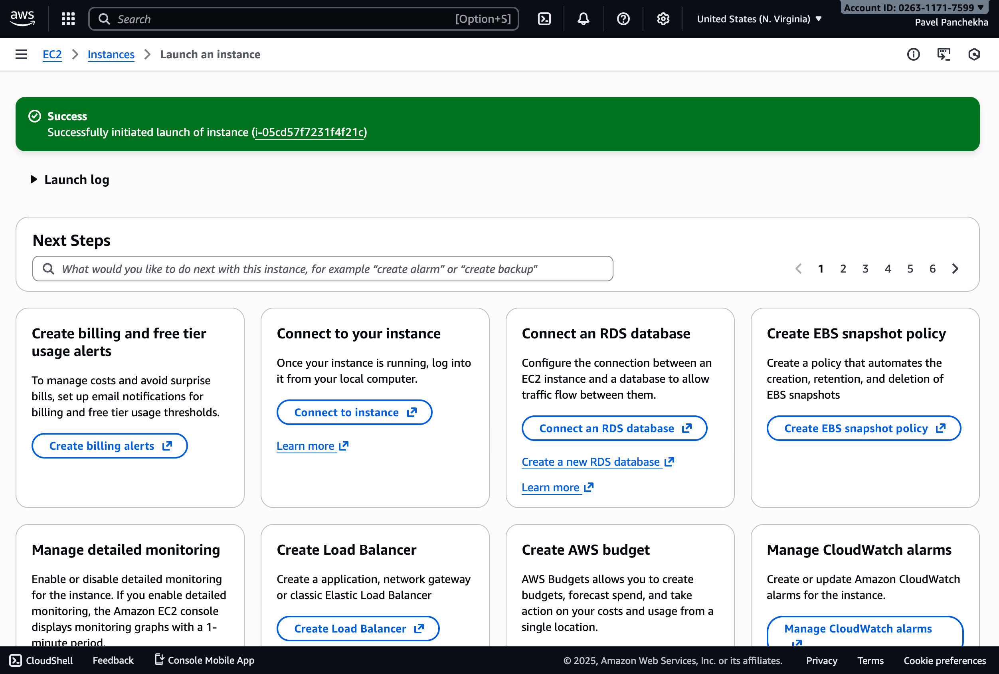
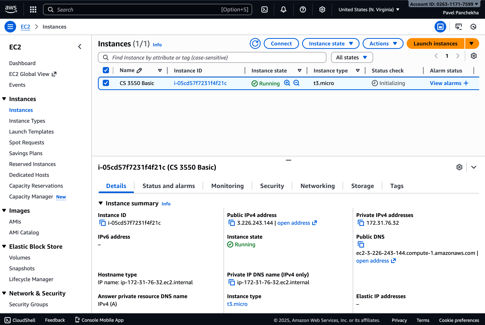
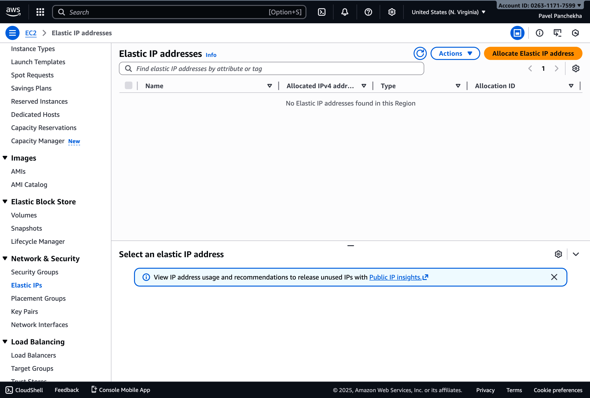
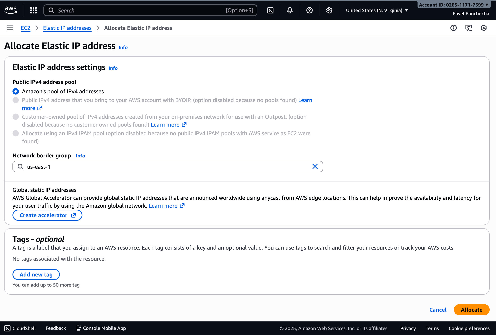
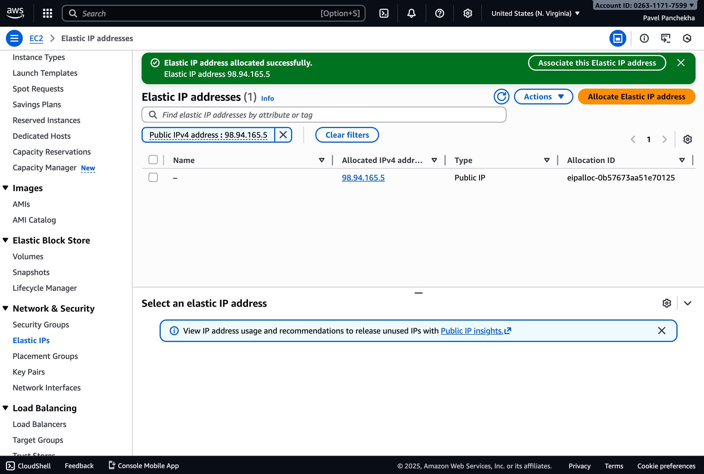
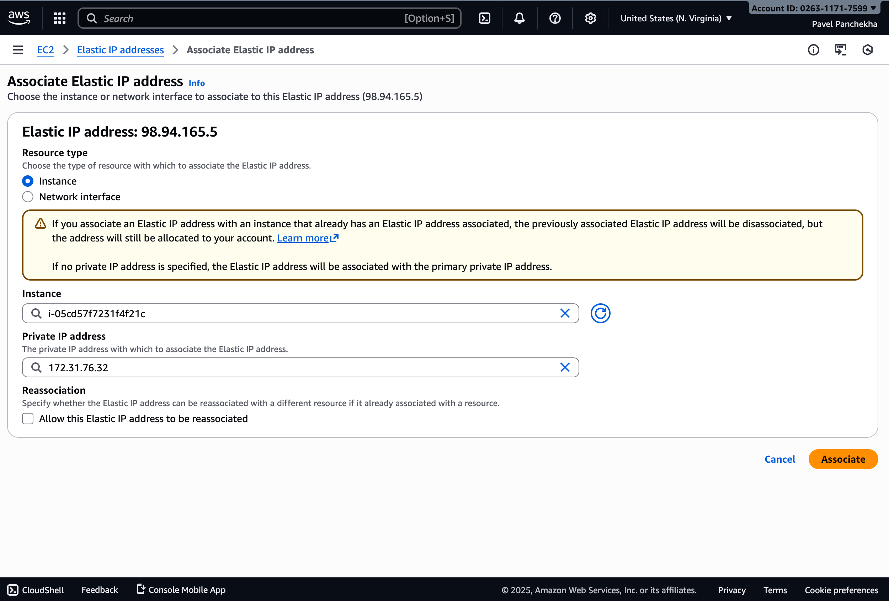
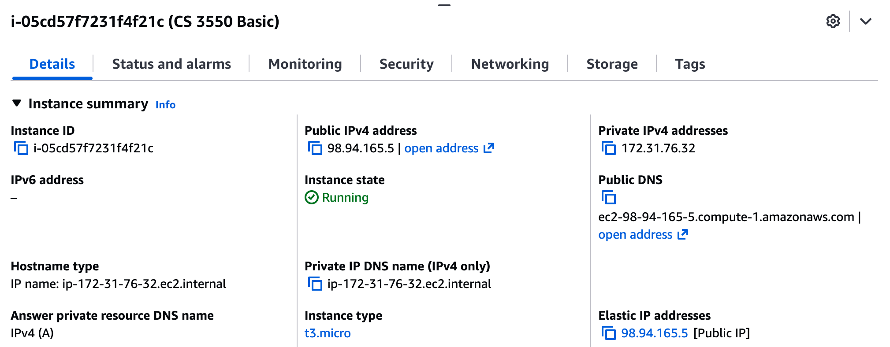

CS 3550 Assignment 7 (AWS)
==========================

**Status**: Final \
**Due**: Phase 1 due **28 Nov**, Phase 2--5 due **5 Dec**

About
-----

In this assignment you'll deploy your recipe website to AWS EC2,
making it publicly accessible. Specifically, you will:

- Purchase a domain name
- Rent a virtual computer from Amazon Web Services
- Install Django and NGINX to that virtual machine
- Set up that machine to serve your website
- Acquire LetsEncrypt certificates for your website

The assignment is due Friday, 5 Dec before midnight. The course's
normal extension policy applies. This due date is right before finals,
so we **strongly encourage** you to finish early. We've written this
assignment to make that possible.

> [!NOTE]
> Handing in this assignment is different from normal.

General Rules
-------------

By and large, this assignment involves carefully following directions,
with little need for creativity. Please *feel free to ask for help*
and include screenshots, error messages, or the like; it's not
plagiarism unless it's literally someone else clicking the buttons.

Likewise, feel free to use online guides for setting up EC2 machines,
NGINX, and similar. There are many, often with detailed screenshots.
That said, EC2, NGINX, and all other services change over time and
some online guides may be out of date.

Do not move on to a later phase until all of the earlier ones are
done. If you're having trouble with some phase, seek help, including
on Piazza, at office hours, or after class.

Both AWS and Linux are pretty complicated and if you don't follow the
instructions it's possible to make pretty complicated mistakes. It's
worth trying to fix things, but sometimes the easiest way to get an
instance working is to delete it and start over, this time following
the instructions more carefully.

In these instructions we'll be using tools like SSH and SCP to connect
to your remote machine. These tools are available by default on macOS,
Linux, and the Windows Subsystem for Linux, and it's recommended that
you use one of these platforms.

That said, if you'd like to use Windows but you don't want to use
Windows Subsystem for Linux, you can download a suite of programs
called PuTTY from [putty.org](https://putty.org). PuTTY implements SSH
and SCP as a native Windows application, and can be used instead of
SSH and SCP in this assignment. Google searches like "Windows PuTTY
connect to AWS EC2 machine" will route you to many guides with
screenshots.

Phase 1: Purchasing a domain
----------------------------

The first step is to purchase a domain for your website. These cost
real money; the price depends on the domain. Typically, popular
top-level domains like `.com` and `.ai` cost more, as do shorter
domain names. But longer domain names on less-popular top-level
domains can be had for under $10, and sometimes under $5.

To purchase a domain, you must use a *registrar*. Popular registrars
that are well-regarded include [namecheap.com](https://namecheap.com),
[gandi.net](https://gandi.net), and [hover.com](https://hover.com).
Each of them allows you to search for a domain name, confirm that it
is available, and then purchase it.

It's worth checking multiple registrars because they sometimes have
deals or coupons. Also, if you sign up for the [Github for Education
pack](https://education.github.com/pack), you get a free `.me` domain
from Namecheap, which is also fine for this assignment.

What you're purchasing is *one years'* registration for the domain. At
the end of the year, you either have to renew the registration (for
roughly the same price, usually) or you lose the domain and someone
else can purchase it. In other words, you're renting, not buying.

Once you've purchased a domain, go to the registrar website and log
in. You now need to modify the domain's "DNS records". The details
differ by registrar. For example, in Namecheap, you would first select
your domain and then click on "Advanced DNS" to go to the DNS record
page. If in doubt, google the name of your registrar and "add DNS
record". This is the core of what a domain registration is, so every
registrar should offer it.

Add a DNS record for your domain. A DNS record consists of four parts:

- A record type. You want `TXT`, meaning "text".
- A host. You want `@`, which means it applies to your domain as a
  whole, not to any subdomain.
- A value. This should be your name as it appears in Canvas, with any
  non-ASCII letters (like Ñ) replaced with a close equivalent (like N).
- A "TTL", which is a length of time, in seconds, for which this
  record may be cached. You want 3600 (1 hour).

After you add a DNS record, it will take some time to propagate to
every other computer on the internet. How long exactly depends on your
registrar, ISP, and physical location, but it might take only a minute
or two and typically no more than a half hour. If you've waited an
hour and it still doesn't work, you did something wrong.

Once you've added the DNS record, you can confirm that it worked by
looking up your domain on [nslookup.io](https://nslookup.io) or a
similar website. You should see your TXT record (scroll down).
  
To complete this phase, create and commit a text file named
`DOMAIN.md` which contains just your domain name and nothing else,
like so:

    mydomain.whatever

This phase is autograded; if you see a green checkmark, you are done.

In some cases the autograder might have the wrong name on file and you
might fail, through no fault of your own. The autograder is using
Canvas names but those don't always match other names the University
has on file for you. In this case, the autograder's output will tell
you what name it's expecting; please change the TXT record to match
(after which you should pass) or email the instructors if that doesn't
work.


Phase 2: AWS and EC2
--------------------

In this phase you will rent a virtual computer from Amazon Web
Services (AWS), which you will then deploy your application to in
later steps.

# Create an AWS account

First of all, we need an AWS account.

Head over to [AWS](https://aws.amazon.com) and click the "Create an
AWS Account" button in the top right. You'll need to provide a "root
email account" and a username. The email and username don't have to
match an existing Amazon account, but can if you want, which might
change the flow a little bit.

In either case, you'll go through an email verification flow, where
you receive an email and click a link / copy a code from the email
into the AWS website. The email should come from
`no-reply@signup.aws`. Yes, AWS owns its own top-level domain.
Finish the account setup flow, which involves picking a password and
possibly signing up for two-factor authentication.

Finally, log in to the AWS console. The default login page asks for an
"IAM user". You don't want that; you want to sign in as a "Root user".
(It's what it sounds like---the root user has full access to the
account, and can create IAM users with more restricted access.)

In the top-left corner, find the button that looks like a 3×3 grid of
little squares, and click it. In the menu, select "Compute" and then
"EC2":


You should see something that looks like this:




# Creating an instance

Next, we will ask AWS to create a virtual computer for us.

Click the "Launch instance" button. An *instance* is AWS's terminology
for a virtual computer in the cloud. You should see a screen like
this:



Give it a name and then, in the "Application and OS Image" section,
select "Ubuntu". Ubuntu is a popular variety of Linux. Make sure the
"Amazon Machine Image" box below says "Free tier eligible" in the
top-right corner:



In the "Instance type" section, select `t3.micro` (the default). This
dictates the CPU and memory your virtual computer will have; this
specific instance type because it is more than sufficient for our
needs and is also eligible for the "free tier", which allows roughly
one total month of uptime, per year, for free.

In the "Key pair (login)" section, click the link labeled "Create new
key pair", give it a name, choose "RSA" for the key pair type. Choose
".pem" for the file format if you're on macOS, Linux, or WSL, and
choose ".ppk" if you're using plain Windows. Click "Create key pair".
Your browser will download a file. **Do not lose this file.**

> [!NOTE]
> If you do lose this file, you'll have to start over at Phase 2.

In the "Network settings" section, click the checkboxes to allow HTTP
and HTTPS access. Leave the SSH checkbox checked.

Then, in the "Network settings" section, click the edit button in the
top-right corner. Check whether the "VPC" box is empty. If it is,
click the "reload" button next to it and then select "Create default
VPC". Click through the resulting screen to create a default "VPC".
Once you see a green bar reading "You successfully created
vpc-xxxxxxxxxxx", head back to the EC2 page (it should be in another
tab), click the "reload" button next to VPC, and now the VPC input box
should be show some kind of default value. The subnet input box should
also now show "no preference", which is fine. Under Auto-assign Public
IP change the value to "Enable" if it wasn't already "Enable".

Under "Configure storage" leave the default (8 GB of general-purpose
SSD storage) in place.

Do not modify anything under "Advanced details".

Under "Summary" ensure that the number of instances is 1.

Click "Launch instance". You should see a brief loading bar and then a
green banner saying "Successfully launched instance i-xxxxxxxxxxxxx":



Click the word "Instances" in the breadcrumbs at the top of the page.
You should now see a page that looks like this:



You should see a table in the top-right half of the screen, and there
should be one row in the table. That's your virtual computer. Under
"instance state" it should say "Running"; if it doesn't, wait a minute
or two and refresh the screen. (You're waiting for it to boot.)

Select your instance by checking that row of the table and then use
the "Instance state" dropdown to stop the instance. This turns off
your virtual computer. Refresh until the "instance state" says
"Stopped" (not "Stopping"; wait until it says "Stopped"). Now select
it again and use the same dropdown to start the instance.

# Assigning an IP address

Our virtual computer now exists, but it does not have a permanent IP
address. (Instead, a new one is assigned every time it restarts, which
is inconvenient and won't work for permanent web hosting.) We need to
allocate and assign a permanent IP address to our computer.

In the left-hand sidebar click "Elastic IPs" (scroll a bit, it's under
"Network & Security"). You should see this screen:



Click the orange "Allocate Elastic IP address" button in the
top-right corner. You should see this screen:



Leave all settings at their default and click "Allocate" at the bottom
of this screen. You should see a green banner saying Elastic IP
address allocated successfully" and be looking at a new table with one
row in it:



Select the one row (it may already be selected) and click on the
Actions > Associate Elastic IP menu button. Leave the "Resource Type"
at its default value, "Instance", and then click into both the
"Instance" and "Private IP address" fields and select the one option
from the dropdown. It should look like this:



Click the "Associate" button at the bottom of the page.

In the left-hand sidebar, select "Instances" to get back to page with
the familiar table of instances. Select your one instance by checking
its box. In the bottom-right half of the screen, check that there's
now a value under "Elastic IP address", like `98.94.165.5` here:



Add the Elastic IP to the `DOMAIN.md` file. It should be formatted
like this:

    mydomain.whatever
    ip.ip.ip.ip

Commit and push to Github.

> [!NOTE]
> Be careful with starting and stopping your instance. When it's
> running you are using credits. You start with about $100 worth, and
> when those are up AWS will want you to pay more. The cost is roughly
> $10 per month of uptime, so you're not going to run out any time
> soon, but don't forget about it either.
>
> While you're working on your assignment, you can turn off the
> instance to save money. (You'll still, however, be paying for your
> Elastic IP.) But to grade your assignment you will need your
> instance on. Luckily, the $100 credit should be plenty.
>
> After your assignment is graded, *do* turn off (or delete) your
> instance and release your Elastic IP.

# Connecting to your machine

We're now going to connect to your virtual computer.

Write down your Elastic IP. We'll need it in a second.

Locate the "key pair" file you downloaded earlier. If you're on macOS,
Linux, or WSL, it should be called `file.pem`. (If you're on plain
Windows, skip this and see below.) Run the following commands:

    cd directory/with/file.pem/
    chmod 0700 file.pem
    ssh -i file.pem ubuntu@ip.ip.ip.ip

Substitute in the appropriate directory, file name, and Elastic IP
address. If you get an error message about "Unprotected private key
file" and you are on WSL, you might try putting `sudo` in front of
`ssh`, as in `sudo ssh ...`, for this and every other `ssh` command
and `scp` command in this assignment.

If you are using plain Windows (not WSL), you'll need to do things
slightly differently:

 - Make sure to create and download a PPK key file, not a PEM file
 - Use PuTTY's UI to select an SSH connection
 - Put in the Elastic IP and select the PPK file as the key
 - When asked for a username, type in `ubuntu`

In either case, you should now be connecting to your virtual computer.
Since you're connecting for the first time, it'll ask if you're sure.
You are. You'll know you've logged in when you see a bunch of output
and then a command line prompt that starts with `ubuntu@`. If you see
this, move on to the next phase. Otherwise, seek help.

Phase 3: Installing essential software
--------------------------------------

In this phase, you'll be installing and configuring Python, Django,
and NGINX. You'll run all of the commands in the SSH/PuTTY window.

# Installing NGINX

First refresh the software installer:

    sudo apt update

Then install essential upgrades:

    sudo apt upgrade
    
If it asks you whether you want to continue, press Enter. This may
take a few minutes. If it asks you questions, click through them using
Tab and Enter, leaving everything at the defaults.

Install updates is important because there may be security-essential
fixes in the upgrades. We want to install them before exposing any
services to the wider internet.

Next install Python, the Python package manager PIP, the NGINX web
server, and the Certbot certificate manager plus its NGINX plugin:

    sudo apt install python3 python3-pip nginx certbot python3-certbot-nginx
    
Again, press Enter when asked whether to continue. If asked further
questions, click through them as before. This will also take a few
minutes.

Start NGINX by running:

    sudo systemctl start nginx

This should not produce any output; if it does, get help.

Wait a few seconds and then run:

    sudo systemctl status nginx

You should see a bunch of output that starts with a green dot and
includes the green text "active (running)", like so:


If you don't see that, seek help. If you do, press "Q" to exit.

Open your browser and navigate to that IP address, as in
http://XX.XX.XX.XX/ with your particular IP address in there. Make
sure you're using `http://`, not `https://`; we'll add support for
HTTPS only in Phase 5. You should see a default web page for the NGINX
web server.

Also run the following command:

    sudo systemctl enable nginx

This instructs NGINX to start automatically when the machine is
rebooted, which is convenient if you need to pause your work.

# Installing Django and configuring NGINX

Next, install Django:

    python3 -m pip install --break-system-packages django
    
The scary `--break-system-packages` flag installs the `django` package
system-wide. If you were deploying several Django services on one
machine, you wouldn't want to do this (you'd use [virtual
environments][venv]) but for our simple deployment installing
system-wide is OK.

[venv]: https://docs.python.org/3/library/venv.html

Run the following command to make sure this worked:

    python3 -m django version

Make sure it prints a version that starts with 5.

Now edit the NGINX configuration. To do so, run the following command:

    sudoedit /etc/nginx/sites-available/default

You are now using a text editor called Nano. You can type like normal
to add text to the file, and use the keyboard shortcuts shown on the
bottom of the screen to save the file, delete lines of text, and so
on. For example, the keyboard shortcut `^K` means you press `Ctrl+K`
to cut a line of text; you can paste it with `^U` meaning `Ctrl+U`.

You can exit Nano with `^X` (meaning `Ctrl+X`); it'll ask you whether
you want to save changes, and you can press "Y" to indicate that you
do. If it asks you for the file name to write to, do not change the
file name it suggests, which should start with `/var/tmp`. The
`sudoedit` wrapper around Nano will take care of overwriting the
actual NGINX configuration file. This is done for security; Nano
itself is run without superuser privileges.

Edit the file until it contains the following text *and nothing else*:

    server {
        listen 80 default_server;
        listen [::]:80 default_server;
        server_name mydomain.whatever;
        
        location / {
            proxy_pass http://localhost:8000/;
        }
    
        location /static/ {
            root /home/ubuntu/cs3550/;
        }
    }
    
Make sure to put in your actual domain name on the `server_name` line.
Also make sure to end each line with a semicolon as above. How
you indent lines does not matter but using TAB is standard.

This configuration tells the NGINX server to listen on port 80, both
in IPv4 and IPv6 mode, and to refer to itself as your domain. It then
asks NGINX to forward all requests to port 8000, where you will run
your server. But requests that start with `/static/` are instead
served directly by NGINX, which is faster than forwarding to Django.

In this setup---where NGINX handles all requests but forwards them to
Django---NGINX is called a "gateway server", while Django is called
the "application server". This allows NGINX to handle complications
like HTTPS traffic and also static files quickly, while Django can
focus on handling the application-specific logic. This is a common
deployment strategy.

Restart NGINX by running:

    sudo systemctl restart nginx

Visit your web server again, by going to http://XX.XX.XX.XX/ as
before. You should now see a "502 Bad Gateway" or "504 Gateway
Timeout" error page. This is good! It means that NGINX is attempting
to contact your Django server (which isn't running yet). You can now
move on to the next phase, where we get Django running.

However, if you continue to see NGINX's default web page, or you don't
see a web page at all, something has gone wrong. Make sure you've
restarted NGINX, and then run:

    sudo systemctl status nginx

You should again see a bunch of output that starts with a green dot
and includes the green text "active (running)". If you don't see that,
you probably made a typo in the server configuration; the `status`
command may have printed useful error information, or if you can't
figure it out, seek help. (Include a screenshot of the output of the
`status` command.)

Phase 4: Deploy your server
---------------------------

Now we want to copy over our actual web application to your virtual
computer, so we can run it there.

# Copying over the files

You'll need to use something called "SCP". Open a **second terminal
window** and change directory to the folder that _contains_ your Git
repository. In other words, change to the directory that contains the
folder named after you, which in turn contains `cs3550`, `grades`, and
`manage.py`.

On macOS, Linux, and WSL, run, in the same directory:

    scp -r -i directory/to/file.pem repository-name ubuntu@ip.ip.ip.ip:cs3550

*Note the colon after the IP address!* That's important! Also make
sure to put in the correct path to the PEM file containing your key
and also to put in the correct Elastic IP address.

On Windows, you'll instead need to run:

    pscp -r -i C:\directory\to\key.ppk repository-name ubuntu@ip.ip.ip.ip:cs3550

If you get an error about `pscp` not being a valid command, check that
you installed PuTTY. If you're sure you did, find the PuTTY
installation in your "Program Files" or similar and use the full path
to `pscp.exe` in place of `pscp` in the command above.

Once you've successfully executed the command, you should see a lot of
output, one line per file that it's copying over. It can take a
while---10 minutes or so---to complete. Don't close either terminal
window while it's working. If you can't get this command to succeed,
seek help.

# Setting up static files

**Switch back to the terminal that is logged in to your EC2 server**
(or log in again in a new terminal). Run the following:

    ls cs3550

You should see all of the files in your project, in their usual files
and directories.

Now that you have your application on your virtual computer, we need
to set up NGINX to serve your static files. To do so, it needs
permissions to list your home directory and to read all of the files.
You can grant it these permissions with these two commands:

    chmod o+rx cs3550/static
    chmod o+r cs3550/static/*

The first line says all *o*ther users on the system (including NGINX)
should have *r*ead and e*x*ecute permissions on the home directory,
project directory, and static directory; in Linux, the execute
permission is needed to list the files inside a directory.

The second line says all *o*ther users should have *r*ead permissions
on all of the files in `static`.

Now visit http://ip.ip.ip.ip/static/main.css or another static file.
You should see the file show up. If not, check that your NGINX
configuration has the correct `/static/` block. Also check the
permissions on your home directory, the `cs3550` directory, the
`cs3550/static` directory, and all the files in the `cs3550`
directory.

# Running your application

**Still the terminal that is logged in to your EC2 server**, run:

    cd cs3550
    python3 manage.py runserver

Leave the terminal open and this command running. If you close the
terminal, or terminate the command by pressing `Ctrl+C`, you will shut
down your Django application, just like when you're debugging locally.

With the Django application running, open up a regular web browser and
visit http://XX.XX.XX.XX/ as usual. You should see the main page of
your recipe site! However, logging in won't actually work yet, because
we need to switch to a proper production setup. Let's do that next.

Phase 5: Setting up your domain securely
----------------------------------------

In this final phase, we set our application for permanent deployment.

# Run in production mode

Connect once again to your server and change to the `cs3550`
directory. Execute the following command:

    nano cs3550/settings.py

This once again starts up the Nano text editor, this time editing your
`settings.py` file. If you see an empty file, you're in the wrong
directory; exit with `Ctrl+X`, don't save the file, and change to the
correct directory before starting Nano again.

Find the line in the file reading `DEBUG = True` and change it to
read:

    DEBUG = False

Then find the line reading `ALLOWED_HOSTS = []` and change it to:

    ALLOWED_HOSTS = ["localhost"]

This is because only NGINX should be allowed to connect directly to
your Django application.

After that line, add these lines:

    CSRF_TRUSTED_ORIGINS = [
      'http://ip.ip.ip.ip',
      'http://*.mydomain.whatever',
      'https://*.mydomain.whatever',
    ]

This is necessary for form submissions to work. Note that a normal
deployment won't include the line with the IP and might not include
the `http` line either; we're including them here to make debugging
easier.

Exit Nano (with `Ctrl+X`) and then run the following command:

    nohup python3 manage.py runserver --noreload
    
This starts your Django application once again, but it uses `nohup`
which means that if you close the terminal window Django will keep
running. It also uses the `--noreload` flag, meaning you have to
manually stop and start the server when you upload new code. That's
important because, when you make changes, you don't want Django to
restart before you've uploaded all of the files.

While your server is running under `nohup`, close the terminal window.
Now visit http://ip.ip.ip.ip/ again; your Django application should
still be running. If not, get help.

Make sure that you are running in production (not debug) mode by
visiting an invalid page like http://ip.ip.ip.ip/fake/page. This
should show a bare-bones 404 page instead of the usual colorful debug.
This is important because the debug pages show source code and version
details that we'd rather an attacker not know.

When run in this `nohup` mode, you can stop the server with:

    kill $(pgrep -f runserver)

You can start the server again using the same `nohup` command above.


# Set up your domain

Recall that in Phase 1, you purchased a domain name from a registrar.
Go to the registrar website, log in, and find the DNS record interface
once again.

If there are any existing DNS records, other than the TXT record you
added in Phase 1, delete it. Some registrars add default DNS records
pointing to an "under construction" page. Keep the TXT record.

You now want to add another DNS record:

- Record type: `A`, meaning "IPv4 Address".
- Host: `*` meaning all subdomains.
- Value: your Elastic IP address with with nothing else (no `http://`
  or any extra punctuation).
- TTL: 300, meaning 5 minutes.

Add another, similar `A` record for `@`, with the same value and TTL.
The reason to add two different records is that the `@` record covers
the case without a subdomain (such as `mydomain.whatever`) while the
`*` record covers all subdomains (such as `www.mydomain.whatever`).

Once you've added the DNS record, look up your domain on
[nslookup.io](https://nslookup.io) or a similar website and make sure
you see your Elastic IP address as an A record. You might need to wait
a few minutes, just like when you added the TXT record.

Check that you can now visit `http://mydomain.whatever/` in an
ordinary web browser. If you can't, make sure you're using `http`, not
`https`.

# Setting up HTTPS

Now let's enable HTTPS as well. Run the following command:

    sudo certbot --nginx -d mydomain.whatever -d www.mydomain.whatever

Make sure to substitute in your own domain! You'll now need to enter
your email address (do so), agree to the terms of service (do so), and
choose whether or not to get emails from the Electronic Frontiers
Foundation, the non-profit that develops `certbot` (up to you).

After a bit of a wait you should see `certbot` report that it
succeeded. Run the following:

    sudo systemctl restart nginx

Check that you can now visit `https://mydomain.whatever/`, now using
HTTPS.

# Finishing up

Make sure that the stylesheet, favicon, images, and links all work
correctly. If one of them doesn't, check that you haven't hard-coded
`localhost:8000` into any of your HTML files. All links in your
application should be to host-relative URLs which start with a forward
slash (`/`). If you find any broken URLs, fix them in your local copy
of the code. Then upload that file (but not all the files, so as not
to overwrite `settings.py`), stop the server with `kill`, and rerun the
`runserver` command.

Make sure you can log in and out. Make sure you can see recipe photos
and profile photos. Make sure you can edit recipes and upload new
photos. If not, double-check that you made all the necessary edits to
`settings.py`, stop the server with `kill`, and rerun the `runserver`
command.


Write a cover sheet
-------------------

When you are ready to submit, make sure your Django application is
running, even after you close you terminal window. The TAs will grade
your submission by accessing it from their browser. Make sure you can
view your website in an ordinary browser at the domain name you've
chosen. Make sure that all of the stylesheets, images, favicons, and
links work, that you can log in and out and edit recipes, and that you
can view and upload recipe photos. Make sure both `http` and `https`
work.

**Leave the instance and Django application running** while we grade
your assignment. Grading should be done by Christmas, 25 December. You
should have enough free tier credits to leave the instance running for
the entire duration. **Once you've received your grade, turn off the
instance and Elastic IP** to avoid being charged.

Once you are sure everything works correctly, copy-and-paste the
following text into a new empty text file called "HW7.md":

```
Homework 7 Cover Sheet
----------------------

In this assignment, I completed:

- [ ] Phase 1
- [ ] Phase 2
- [ ] Phase 3
- [ ] Phase 4
- [ ] Phase 5

[ ] I have checked that I did in fact update and push `DOMAIN.md`.

I discussed this assignment with:

- ...
- ...
- ...

[ ] I solemnly swear that I wrote every line of code submitted as part
of this assignment (except that auto-generated by Django).

The most interesting thing I learned in this assignment was ...

The hardest thing in this assignment was ...
```

In the first list, replace `[ ]` with `[x]` for each phase of the
assignment you completed.

Below that, replace `[ ]` with `[x]` after checking that you did in
fact update and push `DOMAIN.md`

In the second list, replace the `...`s with the name of your partner
as well as any other person (student, friend, family, online stranger)
that you discussed this assignment with.

In the oath below that, check the box. Recall that, while you may
discuss the assignment in broad strokes, you must write every line of
code submitted by you, as stated in the oath below this list. This
includes the use of AI tools such as ChatGPT.

In the last two paragraphs, replace the `...` with the most
interesting and the most difficult aspect of this assignment. Don't
just make them a single sentence; the instructors use your answers to
make these assignments more interesting and easier.

Once you are done, commit everything and push it to Github.

How you will use this
---------------------

AWS isn't the only cloud provider, but it's by far the largest, and is
a relatively common way to deploy web applications, including by
renting a virtual computer from the AWS EC2 service like you did.
NGINX and Certbot are also industry standard in web application
deployments.

AWS provides a vast array of other services, with some of the most
commonly-used being S3, a cloud storage service; RDS, a cloud database
service; CloudFront, a content distribution service; Lamdba, a short
task compute service, and many others. Larger web applications would
make use of these services, both to improve performance and also to
reduce costs; some are covered in CS 4550.

Grading Rubric
--------------

This assignment is worth 100 points. The different phases are worth
different weights:

**Phase 1** is worth 10 points. It is graded on:

- You must purchase a domain and name it in `DOMAIN.md`
- You must add a TXT record for that domain containing your name
- That record must shown up in DNS lookup tools such as [nslookup.io](https://nslookup.io)

**Phase 2** is worth 30 points. It is graded on:

- You must create an AWS account
- You must create an instance on EC2 using the `t3.micro` instance
  type and the Ubuntu OS image
- You must assign an Elastic IP to this instance and record the IP in `DOMAIN.md`
- The instance must be running when you are graded.

**Phase 3** is worth 15 points. It is graded on:

- Your instance must be running NGINX on port 80.
- NGINX must proxy all requests to `localhost:8000`.
- NGINX must server static files.

**Phase 4** is worth 15 points. It is graded on:

- Your instance must run your web application
- All stylesheets, favicons, images, and links should work.
- Login/logout should work.
- Recipe editing and recipe photos (including upload) should work)

**Phase 5** is worth 25 points. It is graded on:

- Django is running in production (not debug) mode
- Your instance is accessible from the domain you purchased and
  recorded in `DOMAIN.md`
- Your instance is accessible over HTTPS.

**Cover Sheet** is worth 5 points. It is graded on:

- Cover sheet is formatted correctly.
- All questions on the cover sheet have coherent answers.

Note that if your cover sheet does not list all people you discussed
the assignment with, or misrepresents others' work as your own, that
is academic misconduct and can result in severe sanctions beyond the 5
points the cover sheet is worth. In the most severe cases, the
sanction for academic misconduct is failing this course.
